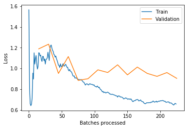
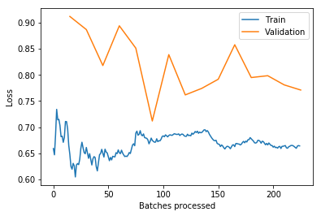

```python
import pandas as pd
import os
import numpy as np
from sklearn.model_selection import RepeatedStratifiedKFold
from fastai import *
from fastai.vision import *
from fastai.callbacks import *
```


```python
df_Test_Train = pd.read_csv('Fastai_dataset_usable_d14.csv')
df_Test_Train.drop(df_Test_Train.columns[df_Test_Train.columns.str.contains('unnamed',case = False)],axis = 1, inplace = True)

df_Test_Train.head(100)
```


<div>
<style scoped>
    .dataframe tbody tr th:only-of-type {
        vertical-align: middle;
    }

    .dataframe tbody tr th {
        vertical-align: top;
    }

    .dataframe thead th {
        text-align: right;
    }
</style>
<table border="1" class="dataframe">
  <thead>
    <tr style="text-align: right;">
      <th></th>
      <th>Crp_Filepath</th>
      <th>clutch</th>
      <th>Day</th>
      <th>egg_number</th>
      <th>sex</th>
    </tr>
  </thead>
  <tbody>
    <tr>
      <th>0</th>
      <td>Cropped_Egg_images/Clutch2_D14/IMG_0002.JPG</td>
      <td>2</td>
      <td>14</td>
      <td>1</td>
      <td>Female</td>
    </tr>
    <tr>
      <th>1</th>
      <td>Cropped_Egg_images/Clutch2_D14/IMG_0003.JPG</td>
      <td>2</td>
      <td>14</td>
      <td>2</td>
      <td>Male</td>
    </tr>
    <tr>
      <th>2</th>
      <td>Cropped_Egg_images/Clutch2_D14/IMG_0007.JPG</td>
      <td>2</td>
      <td>14</td>
      <td>6</td>
      <td>Female</td>
    </tr>
    <tr>
      <th>3</th>
      <td>Cropped_Egg_images/Clutch2_D14/IMG_0008.JPG</td>
      <td>2</td>
      <td>14</td>
      <td>7</td>
      <td>Female</td>
    </tr>
    <tr>
      <th>4</th>
      <td>Cropped_Egg_images/Clutch2_D14/IMG_0010.JPG</td>
      <td>2</td>
      <td>14</td>
      <td>9</td>
      <td>Male</td>
    </tr>
    <tr>
      <th>5</th>
      <td>Cropped_Egg_images/Clutch2_D14/IMG_0013.JPG</td>
      <td>2</td>
      <td>14</td>
      <td>12</td>
      <td>Male</td>
    </tr>
    <tr>
      <th>6</th>
      <td>Cropped_Egg_images/Clutch2_D14/IMG_0014.JPG</td>
      <td>2</td>
      <td>14</td>
      <td>13</td>
      <td>Female</td>
    </tr>
    <tr>
      <th>7</th>
      <td>Cropped_Egg_images/Clutch2_D14/IMG_0016.JPG</td>
      <td>2</td>
      <td>14</td>
      <td>15</td>
      <td>Female</td>
    </tr>
    <tr>
      <th>8</th>
      <td>Cropped_Egg_images/Clutch2_D14/IMG_0018.JPG</td>
      <td>2</td>
      <td>14</td>
      <td>17</td>
      <td>Female</td>
    </tr>
    <tr>
      <th>9</th>
      <td>Cropped_Egg_images/Clutch2_D14/IMG_0022.JPG</td>
      <td>2</td>
      <td>14</td>
      <td>21</td>
      <td>Female</td>
    </tr>
    <tr>
      <th>10</th>
      <td>Cropped_Egg_images/Clutch2_D14/IMG_0025.JPG</td>
      <td>2</td>
      <td>14</td>
      <td>24</td>
      <td>Female</td>
    </tr>
    <tr>
      <th>11</th>
      <td>Cropped_Egg_images/Clutch2_D14/IMG_0027.JPG</td>
      <td>2</td>
      <td>14</td>
      <td>26</td>
      <td>Male</td>
    </tr>
    <tr>
      <th>12</th>
      <td>Cropped_Egg_images/Clutch2_D14/IMG_0028.JPG</td>
      <td>2</td>
      <td>14</td>
      <td>27</td>
      <td>Male</td>
    </tr>
    <tr>
      <th>13</th>
      <td>Cropped_Egg_images/Clutch2_D14/IMG_0029.JPG</td>
      <td>2</td>
      <td>14</td>
      <td>28</td>
      <td>Male</td>
    </tr>
    <tr>
      <th>14</th>
      <td>Cropped_Egg_images/Clutch2_D14/IMG_0030.JPG</td>
      <td>2</td>
      <td>14</td>
      <td>29</td>
      <td>Female</td>
    </tr>
    <tr>
      <th>15</th>
      <td>Cropped_Egg_images/Clutch2_D14/IMG_0033.JPG</td>
      <td>2</td>
      <td>14</td>
      <td>32</td>
      <td>Male</td>
    </tr>
    <tr>
      <th>16</th>
      <td>Cropped_Egg_images/Clutch2_D14/IMG_0034.JPG</td>
      <td>2</td>
      <td>14</td>
      <td>33</td>
      <td>Female</td>
    </tr>
    <tr>
      <th>17</th>
      <td>Cropped_Egg_images/Clutch2_D14/IMG_0035.JPG</td>
      <td>2</td>
      <td>14</td>
      <td>34</td>
      <td>Female</td>
    </tr>
    <tr>
      <th>18</th>
      <td>Cropped_Egg_images/Clutch2_D14/IMG_0036.JPG</td>
      <td>2</td>
      <td>14</td>
      <td>35</td>
      <td>Female</td>
    </tr>
    <tr>
      <th>19</th>
      <td>Cropped_Egg_images/Clutch2_D14/IMG_0037.JPG</td>
      <td>2</td>
      <td>14</td>
      <td>36</td>
      <td>Male</td>
    </tr>
    <tr>
      <th>20</th>
      <td>Cropped_Egg_images/Clutch2_D14/IMG_0038.JPG</td>
      <td>2</td>
      <td>14</td>
      <td>37</td>
      <td>Male</td>
    </tr>
    <tr>
      <th>21</th>
      <td>Cropped_Egg_images/Clutch2_D14/IMG_0039.JPG</td>
      <td>2</td>
      <td>14</td>
      <td>38</td>
      <td>Female</td>
    </tr>
    <tr>
      <th>22</th>
      <td>Cropped_Egg_images/Clutch2_D14/IMG_0040.JPG</td>
      <td>2</td>
      <td>14</td>
      <td>39</td>
      <td>Male</td>
    </tr>
    <tr>
      <th>23</th>
      <td>Cropped_Egg_images/Clutch2_D14/IMG_0042.JPG</td>
      <td>2</td>
      <td>14</td>
      <td>41</td>
      <td>Male</td>
    </tr>
    <tr>
      <th>24</th>
      <td>Cropped_Egg_images/Clutch2_D14/IMG_0043.JPG</td>
      <td>2</td>
      <td>14</td>
      <td>42</td>
      <td>Male</td>
    </tr>
    <tr>
      <th>25</th>
      <td>Cropped_Egg_images/Clutch2_D14/IMG_0046.JPG</td>
      <td>2</td>
      <td>14</td>
      <td>45</td>
      <td>Female</td>
    </tr>
    <tr>
      <th>26</th>
      <td>Cropped_Egg_images/Clutch2_D14/IMG_0047.JPG</td>
      <td>2</td>
      <td>14</td>
      <td>46</td>
      <td>Male</td>
    </tr>
    <tr>
      <th>27</th>
      <td>Cropped_Egg_images/Clutch2_D14/IMG_0050.JPG</td>
      <td>2</td>
      <td>14</td>
      <td>49</td>
      <td>Male</td>
    </tr>
    <tr>
      <th>28</th>
      <td>Cropped_Egg_images/Clutch2_D14/IMG_0052.JPG</td>
      <td>2</td>
      <td>14</td>
      <td>51</td>
      <td>Female</td>
    </tr>
    <tr>
      <th>29</th>
      <td>Cropped_Egg_images/Clutch2_D14/IMG_0053.JPG</td>
      <td>2</td>
      <td>14</td>
      <td>52</td>
      <td>Female</td>
    </tr>
    <tr>
      <th>30</th>
      <td>Cropped_Egg_images/Clutch2_D14/IMG_0055.JPG</td>
      <td>2</td>
      <td>14</td>
      <td>54</td>
      <td>Male</td>
    </tr>
    <tr>
      <th>31</th>
      <td>Cropped_Egg_images/Clutch2_D14/IMG_0056.JPG</td>
      <td>2</td>
      <td>14</td>
      <td>55</td>
      <td>Female</td>
    </tr>
    <tr>
      <th>32</th>
      <td>Cropped_Egg_images/Clutch2_D14/IMG_0057.JPG</td>
      <td>2</td>
      <td>14</td>
      <td>56</td>
      <td>Female</td>
    </tr>
    <tr>
      <th>33</th>
      <td>Cropped_Egg_images/Clutch2_D14/IMG_0058.JPG</td>
      <td>2</td>
      <td>14</td>
      <td>57</td>
      <td>Female</td>
    </tr>
    <tr>
      <th>34</th>
      <td>Cropped_Egg_images/Clutch2_D14/IMG_0059.JPG</td>
      <td>2</td>
      <td>14</td>
      <td>58</td>
      <td>Male</td>
    </tr>
    <tr>
      <th>35</th>
      <td>Cropped_Egg_images/Clutch2_D14/IMG_0062.JPG</td>
      <td>2</td>
      <td>14</td>
      <td>61</td>
      <td>Male</td>
    </tr>
    <tr>
      <th>36</th>
      <td>Cropped_Egg_images/Clutch2_D14/IMG_0063.JPG</td>
      <td>2</td>
      <td>14</td>
      <td>62</td>
      <td>Female</td>
    </tr>
    <tr>
      <th>37</th>
      <td>Cropped_Egg_images/Clutch2_D14/IMG_0066.JPG</td>
      <td>2</td>
      <td>14</td>
      <td>65</td>
      <td>Male</td>
    </tr>
    <tr>
      <th>38</th>
      <td>Cropped_Egg_images/Clutch2_D14/IMG_0067.JPG</td>
      <td>2</td>
      <td>14</td>
      <td>66</td>
      <td>Male</td>
    </tr>
  </tbody>
</table>
</div>


```python
from sklearn.metrics import roc_auc_score

def auroc_score(input, target):
    input, target = input.cpu().numpy()[:,1], target.cpu().numpy()
    return roc_auc_score(target, input)

class AUROC(Callback):
    _order = -20 #Needs to run before the recorder

    def __init__(self, learn,extra=None, **kwargs): self.learn = learn
    def on_train_begin(self, **kwargs): self.learn.recorder.add_metric_names(['AUROC'])
    def on_epoch_begin(self, **kwargs): self.output, self.target = [], []
    
    def on_batch_end(self, last_target, last_output, train, **kwargs):
        if not train:
            self.output.append(last_output)
            self.target.append(last_target)
                
    def on_epoch_end(self, last_metrics, **kwargs):
        if len(self.output) > 0:
            output = torch.cat(self.output)
            target = torch.cat(self.target)
            preds = F.softmax(output, dim=1)
            metric = auroc_score(preds, target)
            return add_metrics(last_metrics, [metric])
```


```python
# Create data bunch
np.random.seed(42)
modified = get_transforms(do_flip = True, flip_vert = False, max_rotate = 35, max_lighting = None, max_warp = .2, p_lighting = 0)
data = ImageDataBunch.from_df('/home/jplineb/Chicken_Proj', df_Test_Train, label_col = 'sex', size = 224, bs = 2, valid_pct=0.25, ds_tfms = modified).normalize()

```


```python
learnd14 = cnn_learner(data, models.resnet18, metrics=error_rate, wd=2)
```


```python
learnd14.fit_one_cycle(15)
learnd14.recorder.plot_losses()
```


Total time: 00:25 <p><table border="1" class="dataframe">
  <thead>
    <tr style="text-align: left;">
      <th>epoch</th>
      <th>train_loss</th>
      <th>valid_loss</th>
      <th>error_rate</th>
      <th>time</th>
    </tr>
  </thead>
  <tbody>
    <tr>
      <td>0</td>
      <td>1.017916</td>
      <td>1.188788</td>
      <td>0.666667</td>
      <td>00:01</td>
    </tr>
    <tr>
      <td>1</td>
      <td>1.156731</td>
      <td>1.233827</td>
      <td>0.666667</td>
      <td>00:01</td>
    </tr>
    <tr>
      <td>2</td>
      <td>1.055543</td>
      <td>0.951783</td>
      <td>0.666667</td>
      <td>00:01</td>
    </tr>
    <tr>
      <td>3</td>
      <td>1.011285</td>
      <td>1.114406</td>
      <td>0.888889</td>
      <td>00:01</td>
    </tr>
    <tr>
      <td>4</td>
      <td>0.893995</td>
      <td>0.884345</td>
      <td>0.555556</td>
      <td>00:01</td>
    </tr>
    <tr>
      <td>5</td>
      <td>0.849969</td>
      <td>0.900749</td>
      <td>0.555556</td>
      <td>00:01</td>
    </tr>
    <tr>
      <td>6</td>
      <td>0.830081</td>
      <td>0.986067</td>
      <td>0.666667</td>
      <td>00:01</td>
    </tr>
    <tr>
      <td>7</td>
      <td>0.769461</td>
      <td>0.960470</td>
      <td>0.777778</td>
      <td>00:01</td>
    </tr>
    <tr>
      <td>8</td>
      <td>0.733247</td>
      <td>1.034755</td>
      <td>0.777778</td>
      <td>00:01</td>
    </tr>
    <tr>
      <td>9</td>
      <td>0.712157</td>
      <td>0.937880</td>
      <td>0.777778</td>
      <td>00:01</td>
    </tr>
    <tr>
      <td>10</td>
      <td>0.697715</td>
      <td>1.012790</td>
      <td>0.666667</td>
      <td>00:01</td>
    </tr>
    <tr>
      <td>11</td>
      <td>0.667990</td>
      <td>0.952279</td>
      <td>0.666667</td>
      <td>00:01</td>
    </tr>
    <tr>
      <td>12</td>
      <td>0.684452</td>
      <td>0.923463</td>
      <td>0.666667</td>
      <td>00:01</td>
    </tr>
    <tr>
      <td>13</td>
      <td>0.672457</td>
      <td>0.959909</td>
      <td>0.666667</td>
      <td>00:01</td>
    </tr>
    <tr>
      <td>14</td>
      <td>0.656455</td>
      <td>0.904160</td>
      <td>0.666667</td>
      <td>00:01</td>
    </tr>
  </tbody>
</table>





```python
learnd14.unfreeze()
learnd14.lr_find()
```


    LR Finder is complete, type {learner_name}.recorder.plot() to see the graph.


```python
learnd14.recorder.plot()
```


```python
learnd14.fit_one_cycle(15)
learnd14.recorder.plot_losses()
```


Total time: 00:26 <p><table border="1" class="dataframe">
  <thead>
    <tr style="text-align: left;">
      <th>epoch</th>
      <th>train_loss</th>
      <th>valid_loss</th>
      <th>error_rate</th>
      <th>time</th>
    </tr>
  </thead>
  <tbody>
    <tr>
      <td>0</td>
      <td>0.664947</td>
      <td>0.912032</td>
      <td>0.666667</td>
      <td>00:01</td>
    </tr>
    <tr>
      <td>1</td>
      <td>0.648999</td>
      <td>0.886862</td>
      <td>0.666667</td>
      <td>00:01</td>
    </tr>
    <tr>
      <td>2</td>
      <td>0.657448</td>
      <td>0.817981</td>
      <td>0.666667</td>
      <td>00:01</td>
    </tr>
    <tr>
      <td>3</td>
      <td>0.656307</td>
      <td>0.894110</td>
      <td>0.666667</td>
      <td>00:01</td>
    </tr>
    <tr>
      <td>4</td>
      <td>0.664362</td>
      <td>0.851289</td>
      <td>0.555556</td>
      <td>00:01</td>
    </tr>
    <tr>
      <td>5</td>
      <td>0.678952</td>
      <td>0.711710</td>
      <td>0.555556</td>
      <td>00:01</td>
    </tr>
    <tr>
      <td>6</td>
      <td>0.681345</td>
      <td>0.838891</td>
      <td>0.666667</td>
      <td>00:01</td>
    </tr>
    <tr>
      <td>7</td>
      <td>0.683375</td>
      <td>0.761733</td>
      <td>0.666667</td>
      <td>00:01</td>
    </tr>
    <tr>
      <td>8</td>
      <td>0.689244</td>
      <td>0.774249</td>
      <td>0.666667</td>
      <td>00:01</td>
    </tr>
    <tr>
      <td>9</td>
      <td>0.668785</td>
      <td>0.791756</td>
      <td>0.666667</td>
      <td>00:01</td>
    </tr>
    <tr>
      <td>10</td>
      <td>0.666053</td>
      <td>0.857818</td>
      <td>0.777778</td>
      <td>00:01</td>
    </tr>
    <tr>
      <td>11</td>
      <td>0.679942</td>
      <td>0.794983</td>
      <td>0.666667</td>
      <td>00:01</td>
    </tr>
    <tr>
      <td>12</td>
      <td>0.668766</td>
      <td>0.798488</td>
      <td>0.777778</td>
      <td>00:01</td>
    </tr>
    <tr>
      <td>13</td>
      <td>0.663323</td>
      <td>0.780908</td>
      <td>0.777778</td>
      <td>00:01</td>
    </tr>
    <tr>
      <td>14</td>
      <td>0.664047</td>
      <td>0.771062</td>
      <td>0.666667</td>
      <td>00:01</td>
    </tr>
  </tbody>
</table>




